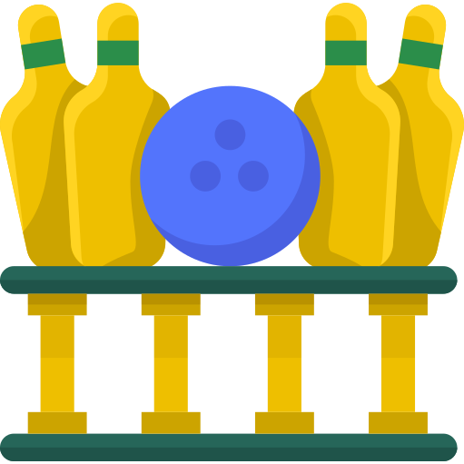

<h1 align="center">Hi, I'm İbrahim </h1> 

Interested in mobile application development. Trying to learn new tech's, things every morning, night, hour blablabla... .

<b>Hobbies</b>
 
Driving all vehicles that are safe and have at least 3 wheels, Fitness, Musics, Camping.  

<b>Tech Stack</b>
  
  
  
  

<b>Github Analytics</b>
  
  
 
  
 
  
  
  

   

  

### 🤝🏻 Contact

